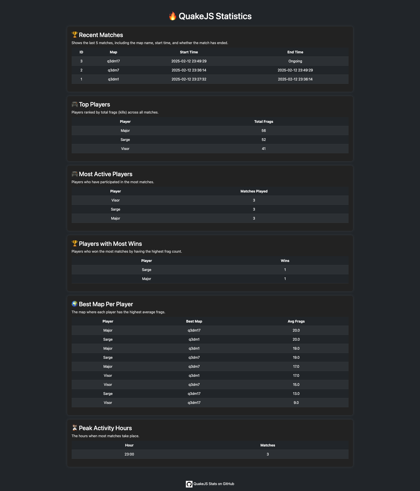

# **QuakeJS Stats Tracker**  



## **📌 Overview**
This project provides a **QuakeJS** server with a **stats tracking system** using **Docker** and **Traefik** as a reverse proxy.  
It includes:  
✅ **QuakeJS Server** for hosting matches.  
✅ **Stats Tracker** to monitor and log player scores.  
✅ **Traefik Proxy** to handle routing and expose the services.  

## **📂 Project Structure**
```
📁 quakejs-stats
├── LICENSE                  # License file for the project
├── README.md                # Documentation on how to set up and use the project
├── 📁 build                 # Contains build-related files for the project
│   ├── Dockerfile           # Dockerfile for building the quakejs-stats service
│   ├── 📁 code              # Python application and monitoring scripts
│   │   ├── app.py           # Main Flask application (if applicable)
│   │   ├── monitor.py       # QuakeJS match monitoring and stats tracking script
│   │   └── 📁 templates     # HTML templates for the web interface
│   │       └── index.html   # Example index page for web interface
│   ├── requirements.txt     # Python dependencies for the stats tracker
│   └── supervisord.conf     # Supervisor configuration for managing processes
├── 📁 data                  # Persistent storage for the application
│   ├── 📁 db                # SQLite database storage for match statistics
│   ├── 📁 dynamic           # Dynamic configuration files for Traefik
│   ├── 📁 logs              # Log files directory for services
│   └── server.cfg           # Configuration file for the QuakeJS server
└── docker-compose.yaml      # Docker Compose configuration to run all services
```

---

## **🚀 Getting Started**
### **1️⃣ Prerequisites**
Before running the project, make sure you have:  
🔹 **Docker** installed: [Install Docker](https://docs.docker.com/get-docker/)  
🔹 **Docker Compose** installed: [Install Docker Compose](https://docs.docker.com/compose/install/)  

---

### **2️⃣ Clone the Repository**
```bash
git clone https://github.com/yourusername/quakejs-server.git
cd quakejs-server
```

---

### **3️⃣ Set Up the Environment**
Create a `.env` file to override default settings if needed:
```bash
SERVER_IP=quakejs-proxy
SERVER_PORT=27960
RCON_PASSWORD=5tr0nG_P@ssw0rd!
TRACKED_PLAYERS=batman,robin,penguin
MATCH_TIMEOUT=3600
DB_PATH=/app/db/quake_stats.db
```

---

### **4️⃣ Create Required Directories**
Ensure necessary directories exist for persistent data:
```bash
mkdir -p data/db
chmod -R 777 data/db
```

---

### **5️⃣ Build & Start the Services**
Run the following command to **build and start** the containers:
```bash
docker compose up --build -d
```
🔹 `--build` ensures the images are rebuilt.  
🔹 `-d` runs the containers in **detached mode** (background).  

Check running containers:
```bash
docker compose ps
```

---

## **🖥️ Access the Services**
| **Service**       | **URL** or **Command**                           |
|------------------|--------------------------------|
| **QuakeJS Game Server**  | `quakejs.example.com` (or IP) |
| **Stats Tracker API** | `http://quakejs-stats.example.com` |
| **Traefik Dashboard** | `http://traefik-dashboard.example.com` |

---

## **📊 Monitoring & Logs**
### **Check Logs for a Service**
```sh
docker logs -f quakejs-stats
```
### **Restart a Service**
```sh
docker compose restart quakejs-stats
```
### **Stop All Services**
```sh
docker compose down
```
---

## **⚙️ Configuration**
Modify `docker-compose.yaml` if needed:
- Modify `environment` variables for different settings.  

Example: Change tracked players in **`quakejs-stats`**:

```yaml
environment:
  - TRACKED_PLAYERS=player1,player2,player3
```

---

## **🐛 Troubleshooting**
| **Issue** | **Solution** |
|-----------|-------------|
| `sqlite3.OperationalError: unable to open database file` | Ensure `data/db` exists and has write permissions (`chmod -R 777 data/db`). |
| QuakeJS not accessible | Check firewall settings and ensure `ports` are correctly exposed. |
| Logs not showing | Run `docker logs -f quakejs-stats` to debug. |

---

## **📜 License**
This project is open-source under the **MIT License**.

---

## **📌 Conclusion**
You're now ready to **run and track QuakeJS matches** using this system! 🎮🚀  
If you encounter any issues, feel free to open an **issue** or **contribute**.  
